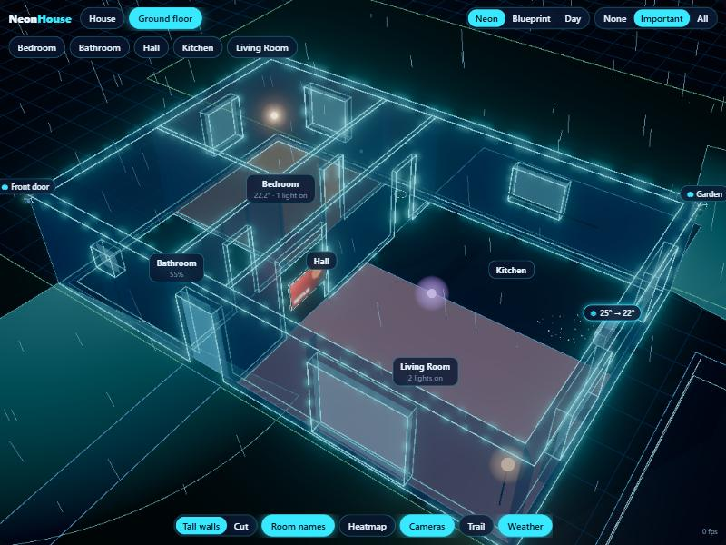

# Neon House Card

Your home as a glowing 3D floor plan on a Home Assistant dashboard. Lights shine in their real colour,
cameras show what they see, the TV shows what's playing, the AC blows, the vacuum drives around – and
it rains on the roof when it rains outside. Everything runs in the browser against your own Home
Assistant: no cloud, no account, no licence key.



## Features

- **Walls from rooms** – draw rooms as polygons; shared edges become one interior wall, outer edges
  outside walls, corners are mitred. Open-plan rooms (`group`), doors, windows, archways, garage doors.
- **Furniture** – beds, wardrobes, desks, sofas (L-shapes too), bookshelves, kitchen counters … each
  just two corners; it turns its back to the nearest wall by itself.
- **Lights** – bulbs, LED strips, floor lamps and floodlights glow in their colour and brightness and
  tint their room. Tap to toggle, long-press for Home Assistant's dialog.
- **Cameras** – the view cone on the ground turns red and pulses on person/vehicle/motion detection,
  with an alert banner. Tap for the **camera cockpit**: live picture plus a flight to the camera's
  point of view.
- **Motion trail** – detections of the last 30 minutes from the recorder, as markers joined in time order.
- **Weather outside** – rain, downpours, snow, clouds, fog, lightning, sun and moon in the right place,
  stars at night, wind-driven rain.
- **Screens** – TVs show the artwork or app colour of their media player.
- **Climate, appliances, vacuum, car** – airflow, glowing appliances above a power threshold, a robot
  that cleans in circles, a car on its bay while it's home.
- **Heatmap** – rooms coloured by temperature or humidity; room labels with values and lights on.
- **Room panel** – tap a room for every entity of its Home Assistant area.
- **Looks** – Neon, Blueprint and Day. House / floor views, cut-away walls, floors pulled apart.
- **Plan checks** – mistakes in the plan show as plain-language warnings on the card.

## Install

1. HACS → ⋮ → **Custom repositories** → add `https://github.com/pant3ras/neon-house-card`, type
   **Dashboard**.
2. Install **Neon House Card**. HACS adds the resource; reload the browser.
3. Add a card:

```yaml
type: custom:neon-house-card
plan_url: /local/neon-house/plan.json   # a file in /config/www/neon-house/
# or put the whole plan inline:
# plan: { version: 1, floors: [ ... ] }
```

For a full-screen 3D view, put it alone in a **Panel** view with `fill: true`.

### Card options

| Option | Default | |
|---|---|---|
| `plan` / `plan_url` | – | The plan inline, or a JSON file under `/local/…`. One is required. |
| `fill` | `false` | Fill the screen below the header (panel views). |
| `height` | `560` | Height in pixels when not filling. |
| `floor` | – | Floor id to open on (default: the whole house; a one-level house opens inside). |
| `theme` | `neon` | `neon`, `blueprint`, `day` (viewers can switch; their choice is remembered). |
| `quality` | `auto` | `auto`, `low` (old wall tablets), `high` (shadows, full bloom). |
| `heatmap` | `none` | `temperature` or `humidity`. |
| `weather` | `true` | `false` hides the weather outside. |
| `trail` | `false` | Start with the motion trail on. |
| `coords` | `false` | Show plan coordinates under the pointer – handy while editing. |
| `stats` | `false` | Frame rate. |

## The plan

A plan is JSON. Lengths are metres; `x` grows to the right, `y` grows **down** (like a drawing on
paper). Use the wall **centre lines** – the axes of an architect's drawing.

```json
{
  "version": 1,
  "weather_entity": "weather.home",
  "north": 0,
  "roof": { "type": "gable", "ridge": "x", "pitch": 30, "overhang": 0.45 },
  "floors": [{
    "id": "ground", "name": "Ground floor", "elevation": 0, "height": 2.7,
    "rooms": [
      { "id": "kitchen", "name": "Kitchen", "area": "kitchen", "group": "day", "polygon": [[5.5, 0], [12, 0], [12, 3.2], [5.5, 3.2]] },
      { "id": "living", "name": "Living Room", "area": "living_room", "group": "day", "polygon": [[5.5, 3.2], [12, 3.2], [12, 8], [5.5, 8]] }
    ],
    "openings": [
      { "type": "window", "at": [12, 5.6], "width": 1.8 },
      { "type": "door", "at": [4.75, 8], "width": 1.0, "entity": "binary_sensor.front_door" }
    ],
    "devices": [
      { "type": "light", "entity": "light.living_room", "pos": [8.75, 5.6] },
      { "type": "camera", "entity": "camera.garden", "pos": [12.15, -0.15], "z": 2.6, "rot": 45, "fov": 110, "range": 7,
        "motion": ["binary_sensor.garden_motion"] }
    ]
  }],
  "outdoor": [
    { "kind": "terrace", "area": "garden", "polygon": [[5.5, -3], [12, -3], [12, -0.2], [5.5, -0.2]] }
  ]
}
```

A complete example is in [`plans/example.json`](plans/example.json).

### Rooms and walls

You never list walls – **every room edge is a wall**. An edge two rooms share becomes one 12 cm
interior wall; an edge only one room has becomes a 30 cm outside wall. Shared corners must use the
same numbers in both rooms; a corner in the middle of another room's edge (a T-junction) is fine.

| Room field | |
|---|---|
| `id`, `name` | Unique id; the label. |
| `polygon` | Corners in order around the room, any shape. |
| `area` | Home Assistant area id: the room panel lists its entities and the room picks up its temperature and humidity sensors. |
| `group` | Rooms with the same group are one open space – no wall between them. |
| `open` | No outside walls either (a covered porch). |
| `temperature`, `humidity` | Pick the sensors yourself. |

- **Remove a wall:** give both rooms the same `group`, or merge them into one polygon.
- **Add a wall:** split a room into two rooms, or add a free-standing one under the floor's
  `"walls": [{ "a": [x, y], "b": [x, y], "thickness": 0.1, "height": 1.1 }]`.
- **Move a wall:** change the coordinate in every room that touches it.

### Openings

`{ "type": "door" | "window" | "garage" | "gap", "at": [x, y], "width": 0.9 }` – `at` is the centre
of the opening on the wall's centre line (up to 60 cm off is forgiven). Optional: `height`, `sill`
(windows), `entity` (a contact sensor or cover: the leaf opens while it's on), `hinge` (`left`/`right`),
`swing` (`1`/`-1`).

### Devices

All devices have `type`, `entity`, `pos: [x, y]`, and optionally `rot` (facing: degrees clockwise,
`0` = up the plan, `90` = right), `z` (height above the floor) and `name`.

| type | Extra fields |
|---|---|
| `light` | `kind`: `bulb` (default, ceiling), `strip` (+ `length`), `lamp`, `flood` |
| `camera` | `fov`, `range`, `motion: [binary sensors]`, `stream` (another camera entity for the live view) |
| `tv` | `width`, `power` (plug/switch used when the TV is fully off) |
| `climate` | – |
| `appliance` | `kind`: `purifier`, `dehumidifier`, `fan`, `plug`, `washer`; `power` + `active_watts` |
| `sensor` | – (shows its value) |
| `vacuum` | `pos` is the dock |
| `car` | `presence` (drawn while on/home), `length`, `width` |

### Furniture

A piece is a rectangle between two opposite corners, under the floor's `"furniture"`:

```json
{ "type": "bed", "from": [0.3, 0.15], "to": [1.9, 2.2] },
{ "type": "sofa", "from": [6.2, 5.2], "to": [9.4, 6.05], "arms": ["left", "right"] }
```

Types: `bed`, `wardrobe`, `dresser`, `desk`, `sofa`, `bookshelf`, `counter`, `cabinet`, `fridge`,
`table`, `chair`, `bathtub`, `shower`, `box`. The side against the wall (a bed's head) is found from
the nearest wall; set `back` (`up`/`down`/`left`/`right`) to override. Optional: `height`, `arms`
(sofas: which short ends get an armrest), `upper` (counters: `false` for no wall cabinets, `2` for two
rows up to the ceiling), `round: true` (tables), `monitor: false` (desks), `name`.

### Outside, roof, sun

`outdoor`: areas with `kind` `grass`, `paving`, `terrace`, `parking` or `water`, a `polygon` and an
optional HA `area`; `roof: true` puts a roof on posts over it (a covered terrace, a carport), at
`roof_height` (default 2.6 m). A cellar is just another floor with a negative `elevation`. `roof`: `type` `gable`, `hip` or `flat`, `ridge` `x`/`y`, `pitch`, `overhang`.
`north`: the compass direction the top of the plan faces (degrees) – it puts the sun in the right
place. `weather_entity`: the weather entity that drives rain, snow and clouds.

## Development

```bash
npm install
npm run dev      # preview with a fake Home Assistant at http://localhost:4170
npm run build    # dist/neon-house-card.js
```

The preview loads `plans/casa.json` if you have one (it is git-ignored, so your own house stays
private), otherwise `plans/example.json`; `?plan=example` forces the example. Saving the plan reloads
the preview and keeps the view. The "Preview controls" box fakes weather, night, detections and the vacuum.

## Licence

MIT
